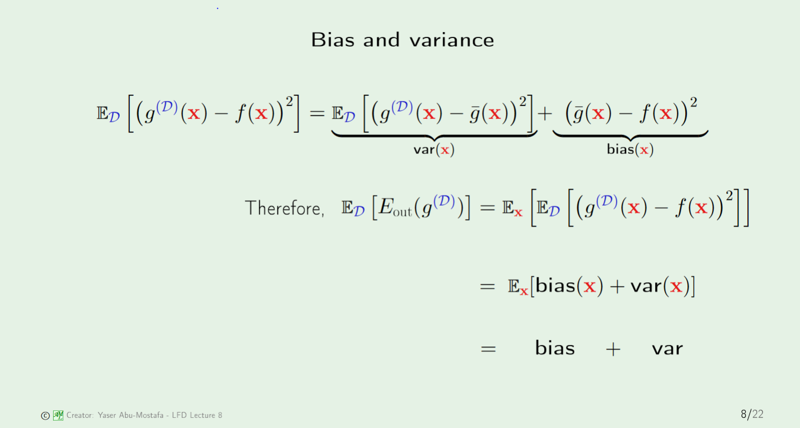
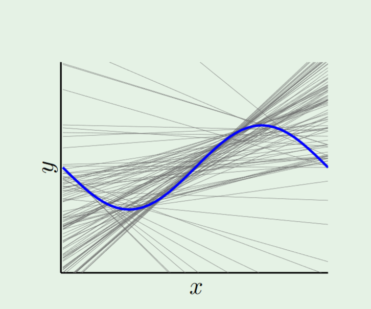
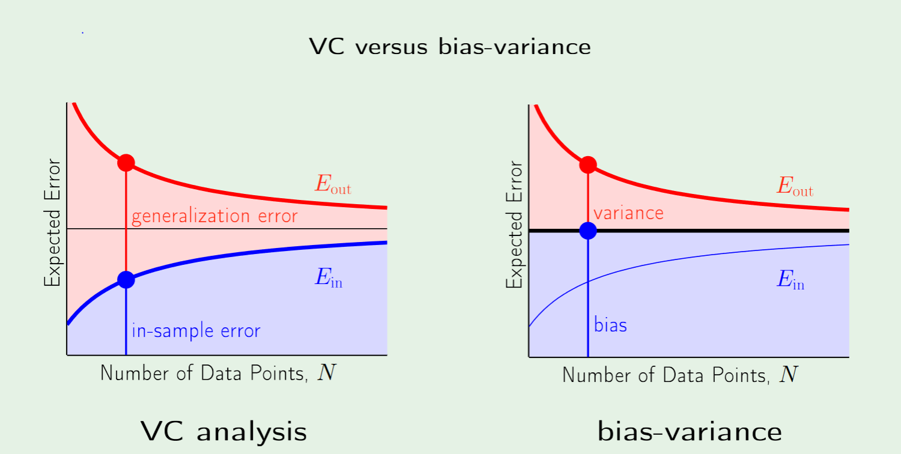

# Bias and Variance
=================
* Although it cannot be used to calculate $E_{out}$, the bias/variance perspective will provide a nice guide to future techniques:
	* Regularization: decreasing variance while maintaing bias.

## Decomposition of $E_{out}$
* By introducing the "average hypothesis", we can split $E_{out}$ into a **average hypothesis bias from target function**, and **variance about average hypothesis**

## Bias-Variance Mental Model
* **Bias/Variance**
	* Complex models have **potentially a closer solution** bc of **average**
	* But more **sensitive to bad/little data**(outliers) bc of high **variance**, and so make it harder to generalize out of sample.

* **VC Bound**: 
	* Complex models have more hypothesis
	* And so have a higher chance of having a bad sample.

## Learning Curves
* **Bias/Variance**:
	* Difference between best and target stays constant
	* Variance decreases as N goes up b/c data is less likely to be bad.
* **VC Bound**:
	* In sample will go up because model ran out of parameters
	* Generalization will go down for same reason as variance.

> Why doesn't the average hypothesis error changes as we change the datapoints?

> Because we have to average over all datasets beforehand. This is the only way to incorporate the variance into the graph.
