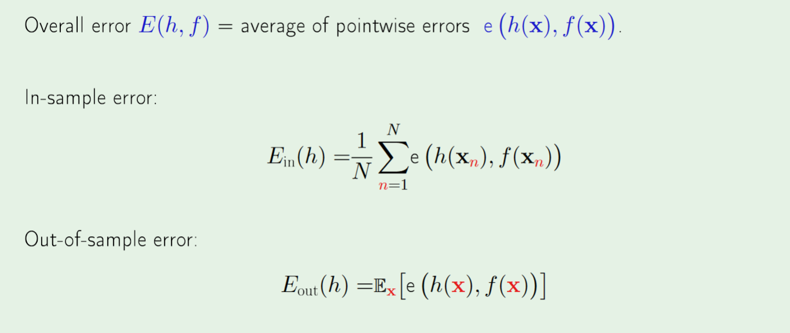
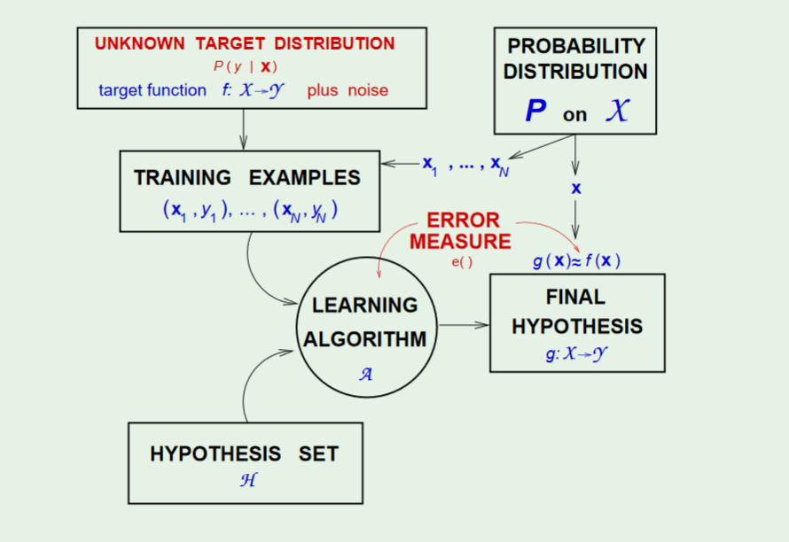

# Error and Noise
===============

## Error as an expected value
---

## Linear Model as a Basis
---
* Bunch of Linear Models=Neural Network
* Efficient Nonlinear Transformation= Kernel Methods
* Careful Selection of Boundaru = Support Vector Machine

## Learning Diagram for Nosy Targets
---

* Noisy targets can occur if we haven't captured the entire input space
* $(\vec{x},y)$ is thus generated by two **seperate** probability distributions, $P(\vec{x})$ and $P(y|\vec{x})$

* **Why is the probability of y dependent on x?**: Because given an input x, we want a probability distribution, not a return value

> Thus, I think the learning diagram is slighly misleading, because our final hypothesis should now be a probability distribution, not a function.

## Recap of Learning
---
1. **Verification**: $E_{in}$ tracks $E_{out}$
* **Optimization**: $E_{in}$ is small $\rightarrow E_{out}$ is small

