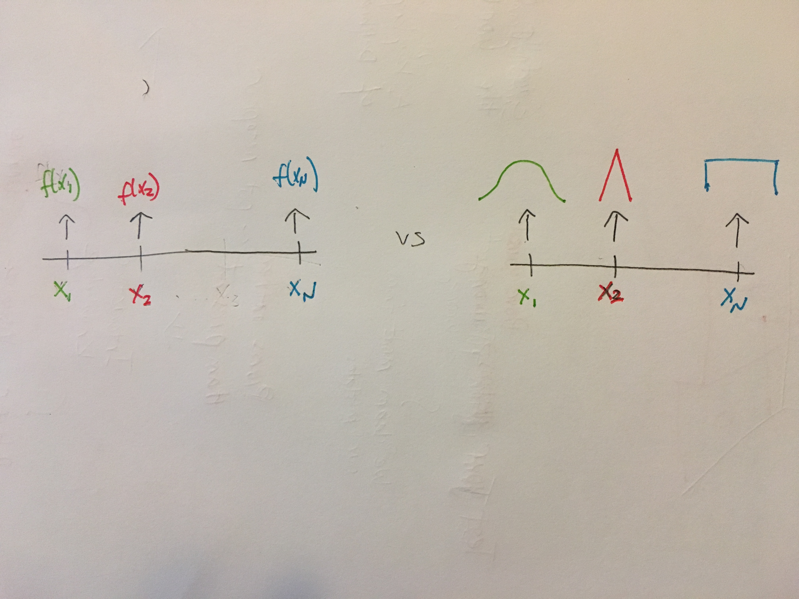

# Error and Noise
===============

## Why is the probability of y dependent on x?
* Because given an input x, we want a probability distribution, not a return value

## Why did I have this question?
* I didn't realize you wre trying to learn a bunch of probabilty distributions
* I thought he said we are replacing a function with a probabilty distribution, we in actuality, we are replacing the output with a probabilty distribution
