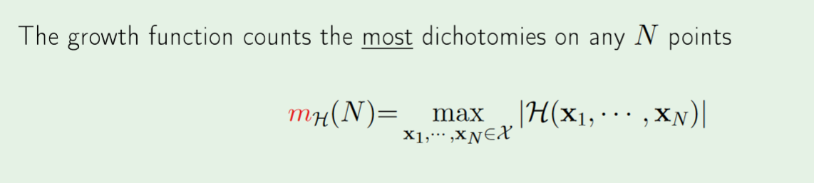

# Improving the Union Bound
=========================

* Remember, the union bound is needed because we don't know which one of the hypotheses will have to track $E_{out}$, even thought we just need to final hypothesis to track $E_{out}$
## Reduce to Finite
---
* **Equivalence Class**: If two different hypotheses return the same output on the training data, then they are consider "equivalent"
$$M\rightarrow 2^{N}$$

## Reduce to Polynomial
---
#### Growth Function
> Why is the breakpoint of triangular sets not 4? You can put a point in the middle of three to "force" the "covering"

> Because we are free to pull that point out. 

* **Calculating the growth function**: Given a "optimal" n points of your "choosing", vary the hypotheses to create as many "colorings" as possible. 
	* In the 1-D case, it is sufficent to just vary either the hypotheses or the points.

$$2^{N}\rightarrow m_{H}(N)$$

#### BreakPoint
* **Independent of DataPoints**: The breakpoint doesn't care about the particular datapoints or even the number of data points. It does depend, however, on the dimension of the dataset, as that changes the hypothesis set.
* The Breakpoint for better models is as expected higher. But this means that the Hoeffding inequality will be weaker.
	* **The stronger the model, the less you will be able to learn.**

$$m_H(N)\rightarrow polynomial$$

