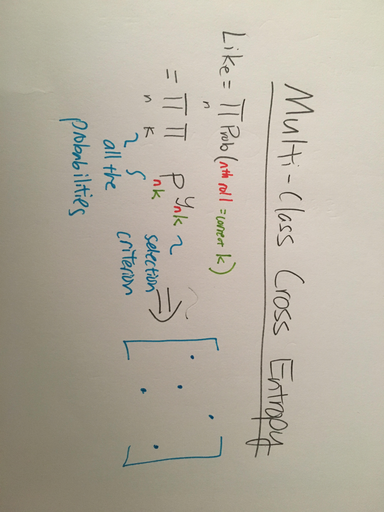

# Intro to Deep Learning
======================

### Interpreting weights in a neural network
* We say a neuron has "learned" an image if it fires on that image.
* In this way, it can only tell you which vectors are important, and not which features.

### One Hot Encoding
* Changes categorical(integer) data into a indication vector
* Number of labels= Number of dimensions
* Done to eliminate "closeness bias" that comes with real numbers.
    * Aka, 3 is no closer to 5 than 4, but the numbers indicate that it is.

### Multi-Class Cross Entropy
* Log of product of probabilities raised to the indicator matrix

