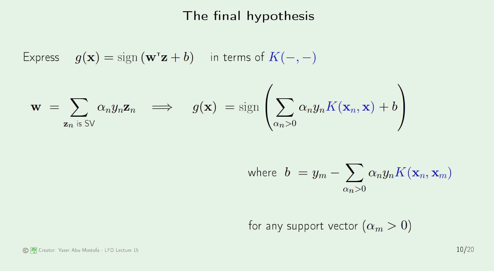
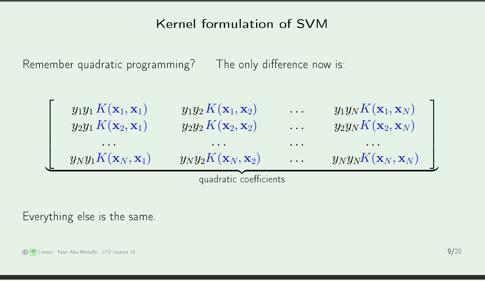
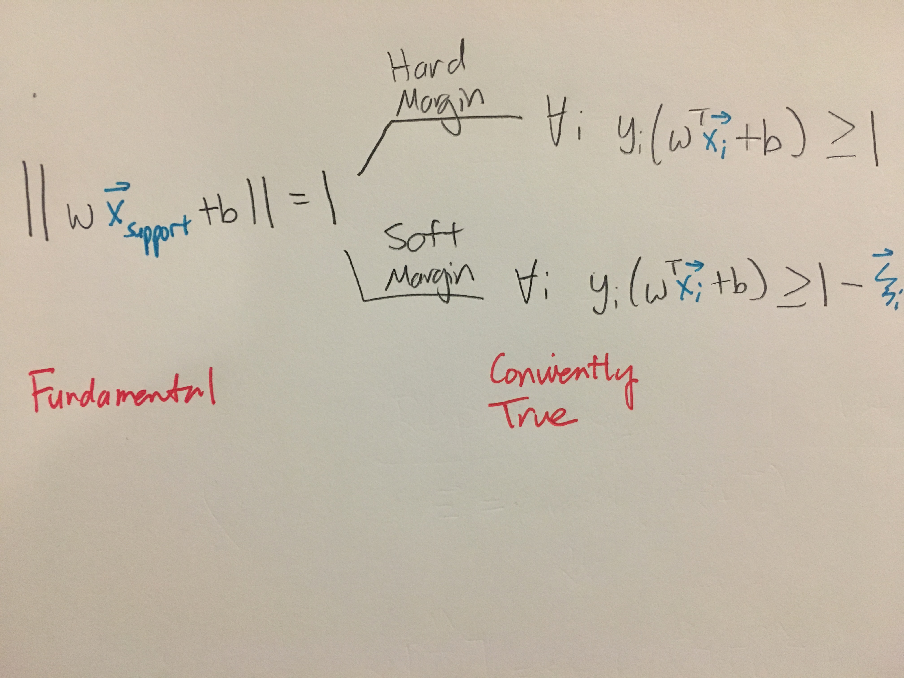
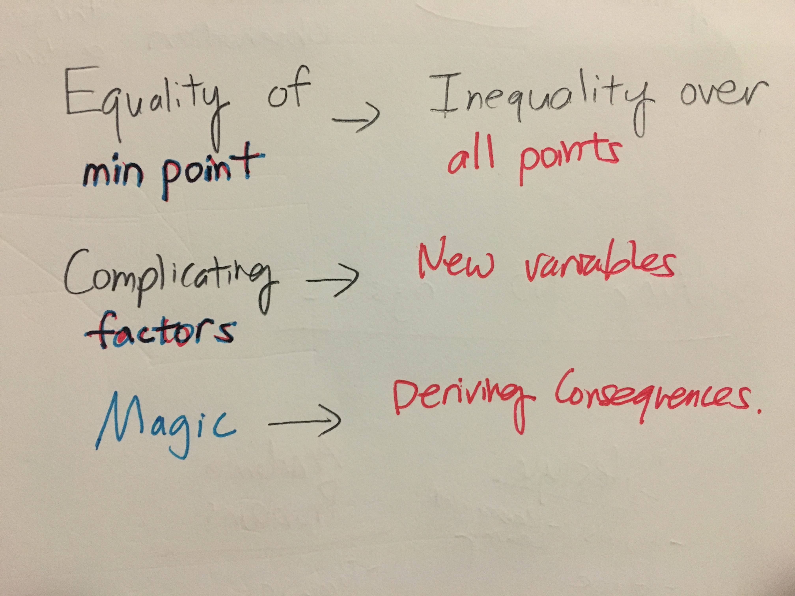

# Kernel Methods
==============

## Kernel Formulation of SVM
In general, we applying a nonlinear transformation, two things change: the final hypothesis and the error function, because these are the objects that depend on the dataset.
* **Hypothesis**

* **Lagrangian(aka Error function)**

## Normalization for SVM with soft margins
> Doesn't the stated inequality violate the normalization condition for the minimum point? It's almost like you can let the normalization be whatever you want.

* The inequality will **only hold if support vectors have norm 1.**
* As it turn out, when minimizing the cost function they do.

## Key Black Boxes Learned from this Chapter
* Inequality allows us to solve for $x_{support}$ and margin **at the same time**.

