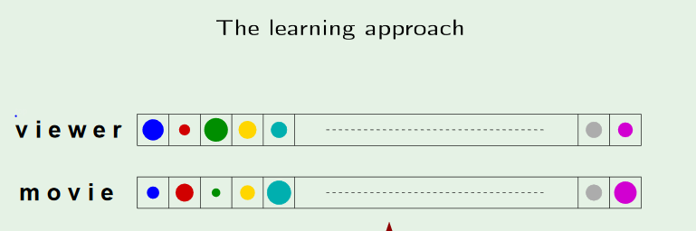
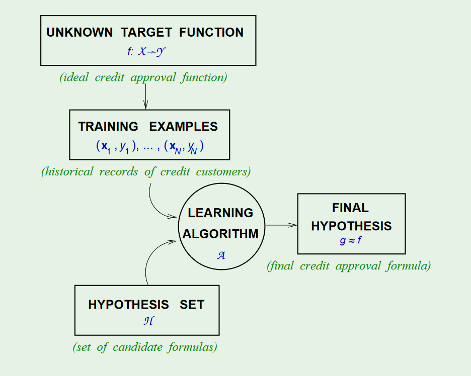
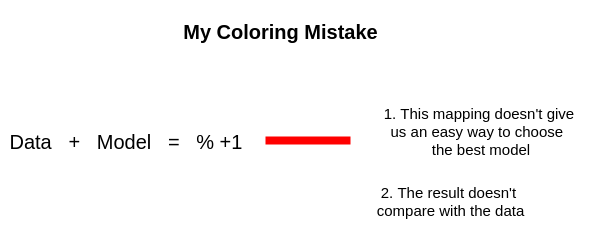

# Lecture 1 and 2
================================

## Illustrating the Learning Approach

Traditional Approach | Learning Approach
--- | ---
1. Rate Movie | 1. Obtain User Rating
2. Input User's Preferences and Movie Rating into a Formula | 2. Input User's Preferences into a Formula and Compare with User's Rating
3. Get User Rating | 3. Have Machine changed Parameters of the Formula
 | 4. Get User's Rating

* **Machine Learning will do whatever it takes to agree with experiment. Thus, machine learning is solely reliant on experiment, and not theory, to provide a model.**

## Formulating the Learning Problem

* Scientist decides the **Hypothesis Set**and **Learning Algorithm**

## Feasibility of Learning
The Learning Problem is basically the following question:

> What can we learn from a finite sample of a large set? Can we trust our models to predict outside the training data?

*  **Mapping to Bins**
We want to map to bins so we can make a probability statement.

* To be fully rigorous, we now need to say the training data was generated by a probability distrubution.

