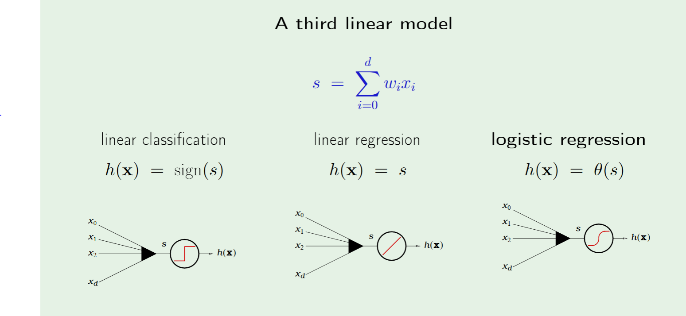
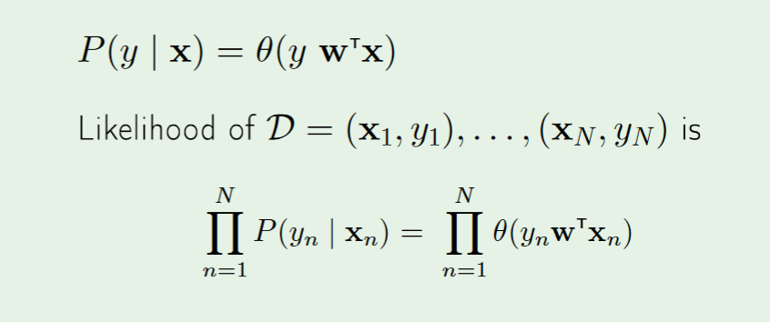
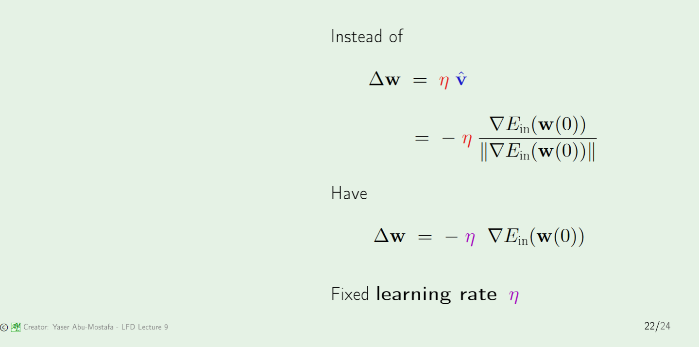

# Logistic Regression
===================

## How it transforms s
* Logistic regression takes the linear form and further acts upon it with a function. This function can be interpreted as a probability.
* One can say logisitc regression takes binary results and returns a binary probability.

> Why is Logistic Regression consider a linear model?

> * Because the boundary is dictated by s(which is linear), not the function. So a logisitic classifier will have a straight line as its model.
* One can think of a logisitic classifier as a way to create a different error measure 

## Likelihood as the Error Measure
* To construct a likelihood, we consider the **converse** of the goal:
	* Given a hypothesis, how likely is it to have generated the dataset that we currently have?

## Massaging into Cross Entropy
1. Take natural logarithm to convert product to sum
* Put negative sign out front to change max of likelihood to min of error.

> Note that when y and x don't agree, the error contribution is large. 
> Also note that the inside looks like a partition function of some sort.

## Variable step size Gradient Descent

