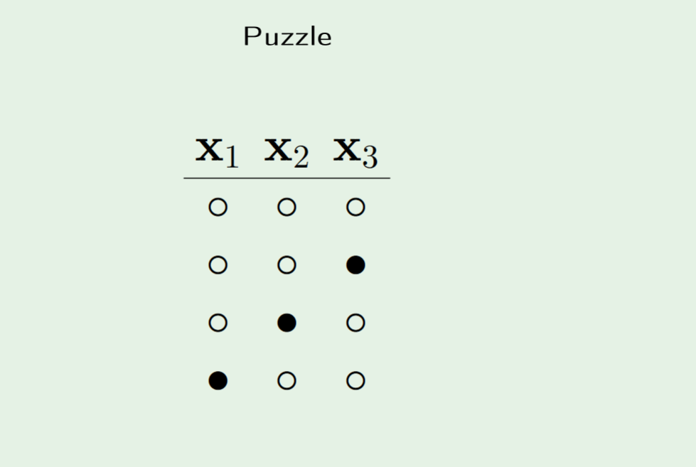

# Misc
====

* Note the constant in the Percepton algorithm can only change by integer amounts. Because of this, the algorithm will seem very chaotic, even though it will converge
* The better your model is, the more likely you will be wrong
* Use hierachy of visualizations to your advantage! Down is better than across

* The probability for Hoeffding's Inequality comes from the distribution of $E_{in}$, aka the data set. It is only by drawing multiple data sets do we get a distribution for $E_{in}$  
