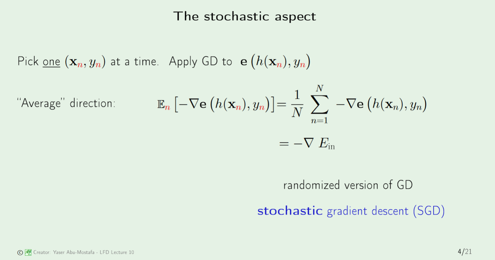
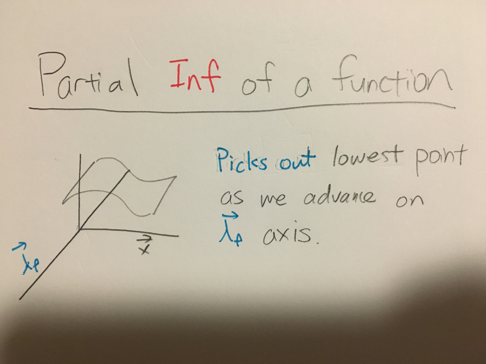
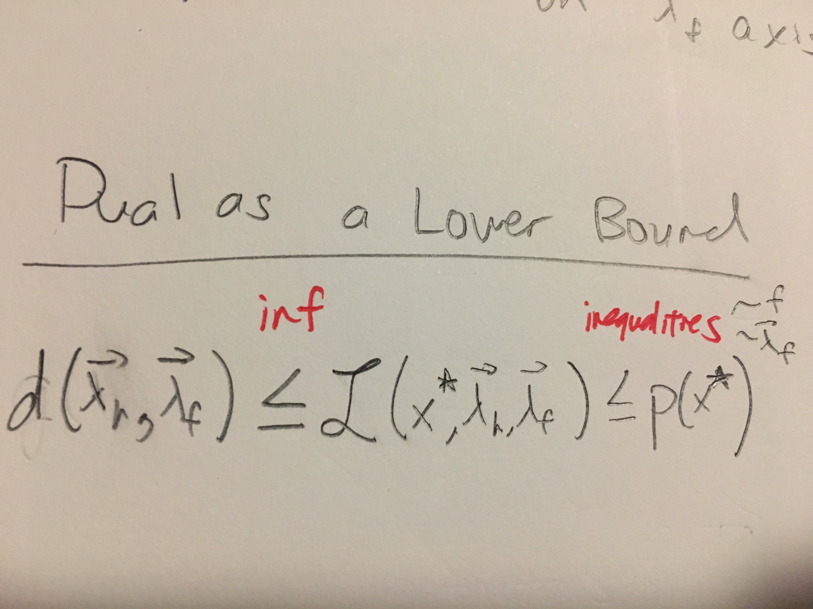
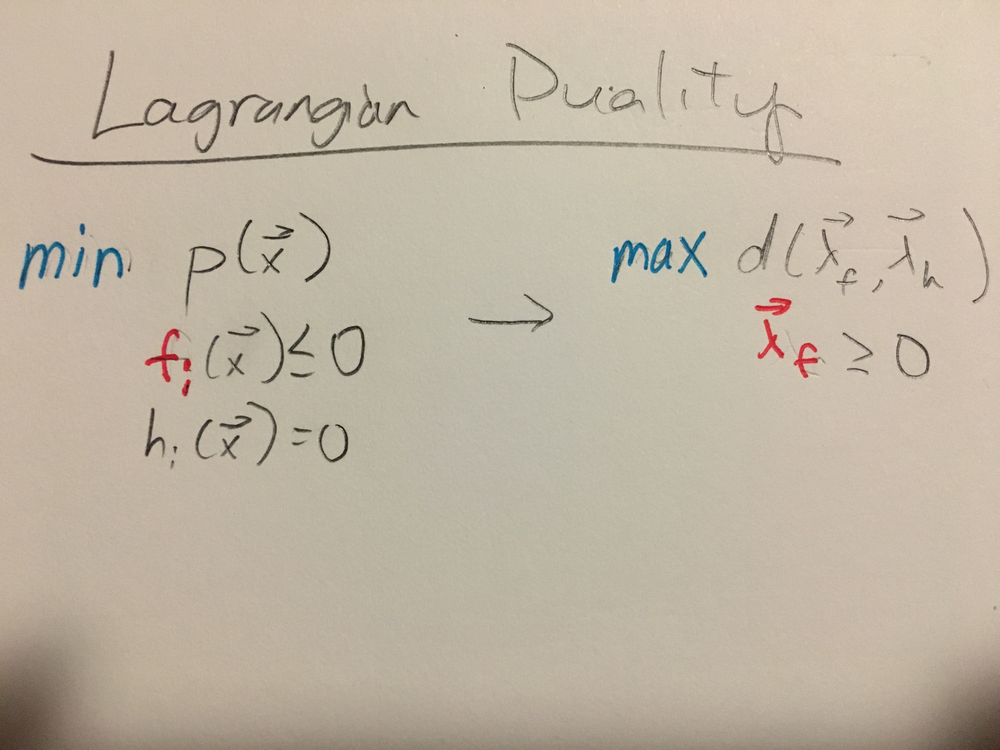
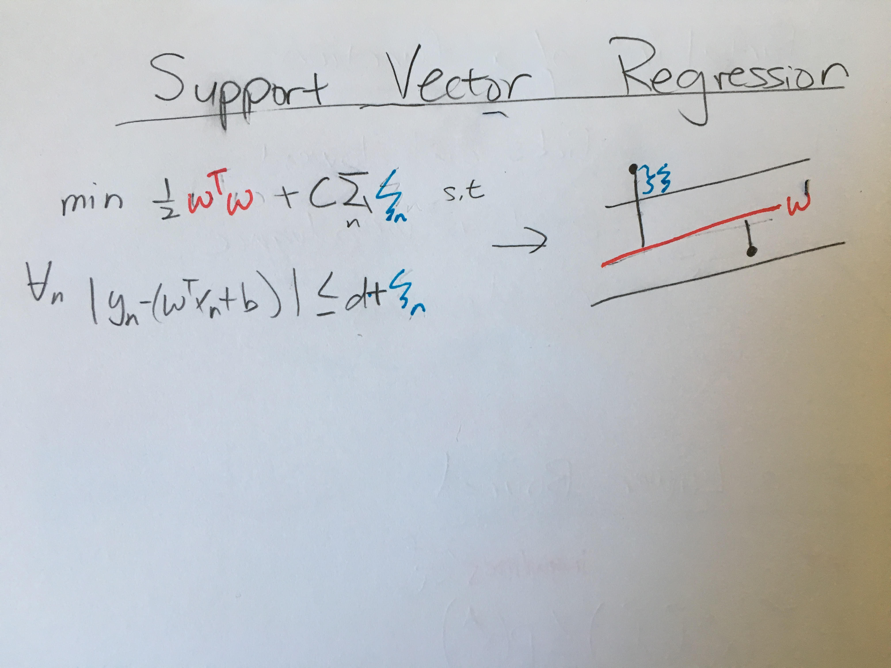

# Misc
====

* Note the constant in the Percepton algorithm can only change by integer amounts. Because of this, the algorithm will seem very chaotic, even though it will converge
* The better your model is, the more likely you will be wrong
* Use hierachy of visualizations to your advantage! Down is better than across

* The probability for Hoeffding's Inequality comes from the distribution of $E_{in}$, aka the data set. It is only by drawing multiple data sets do we get a distribution for $E_{in}$  

* We don't need to normalize the probability results from the Logisitc regression b/c the outcome space is not parameterized by the s parameter.
* You can train many models of the same form at the same time by simply summing their error functions. (See Slide 7 of Neural Networks)
## Stochastic Gradient Descent
* Used when function is a sum of functions(which for us, means a sum of datapoints)
* Randomness is good for avoiding shallow wells

## Partial Inf
* To get inf, we usually take partial derivative and use resultant equation to replace. I am still uncomfortable with this because it allows suprenums to creep in.

## Dual as Lower Bound

## Lagrangian Duality
* What duality does is replace function constraints with variable constraints.

## Extra KKT conditions to ensure equality
1. Dual Feasibility
2. Complementary Slackness.
                
## Support Vector Regression
* **Biased**Support vector regression seems like a biased choice that is gauranteed to be below some defined error, because apparantly "flat" w is good.
* **Predefinng the Margin**: A technical difference between this and classification is that we define the margin

                
                
