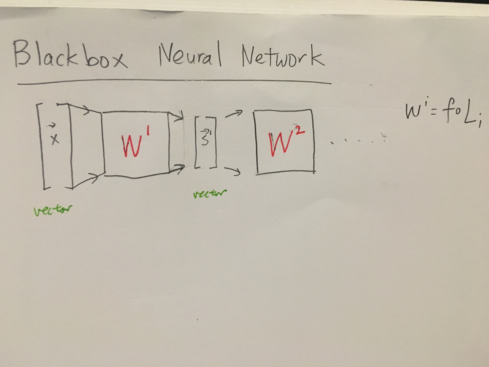
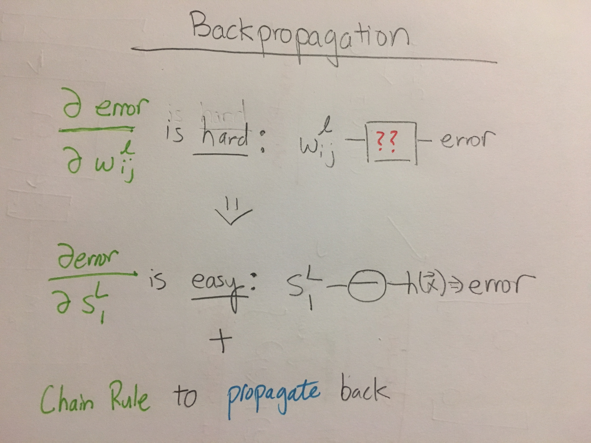

# Neural Networks
===============

## Logic Gates with Perceptons
> We can create complicated models by feeding the binary outputs of perceptons into more perceptons, and change the weights to get the operaton we want.

* AND/OR can be implemented by changing the constant weight vector of a 3 dimensional percepton
* Negatives can be implement by chaning the input weight vectors of a 3 dimensional percepton

## Transition to Neural Network
1. Replace percepton node by tanh(s) nodes
* Allow weight to vary
* More than just 3 inputs into each node

## Compiling the gradient: Backpropagation Algorithm. 
* Calculating the analytic error function is hard, so idea is to reexpress gradient **in terms of a higher level feature**.
* **Algorithm**:
	1. Express in terms of $s^l_{j}$
        * Forward calculate x's
	* Calculate $\delta$ for last layer
	* Backpropagate delta

