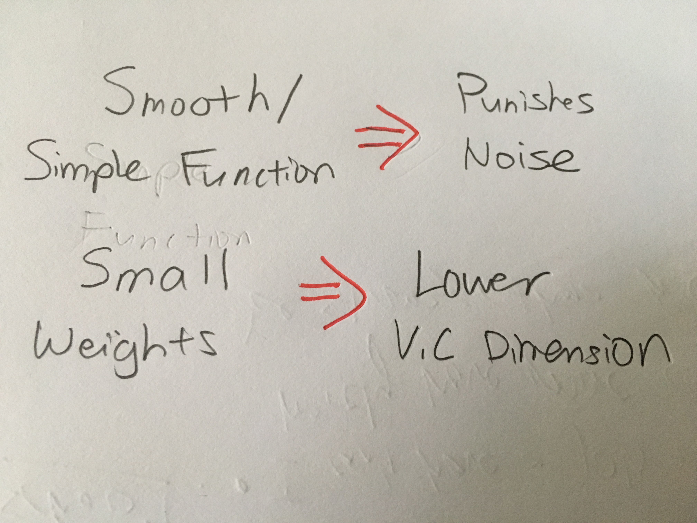

# Overfitting
===========

* Overfitting is when using a **more complex model leads to worse result**
## Overfitting Mental Model
* Dataset Size
	* Most important: with enough data, the other factors are negligible.
	* **Machine learning is achieving the best fit given the data resources. It is not achieving the best fit.**
* Noise Level
* Target Complexity

## Regularizer Key Point

## 3 Regularizers Examples

