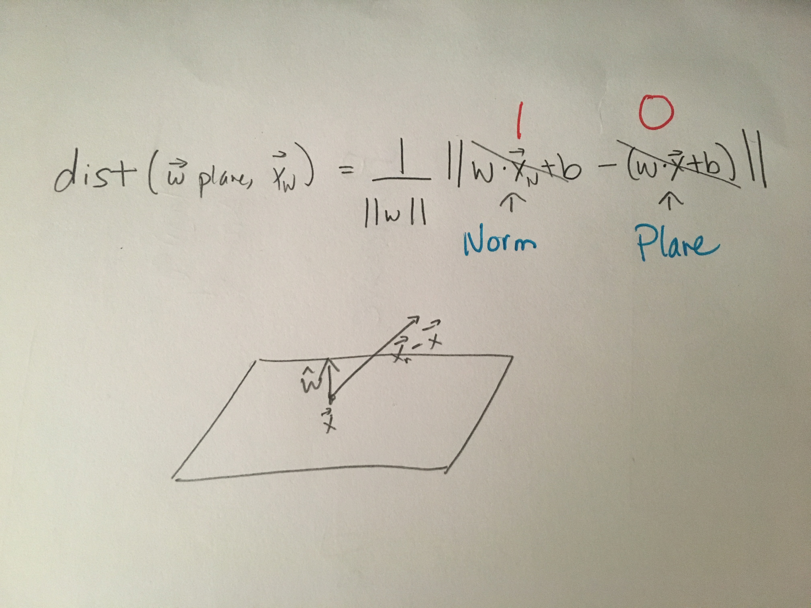
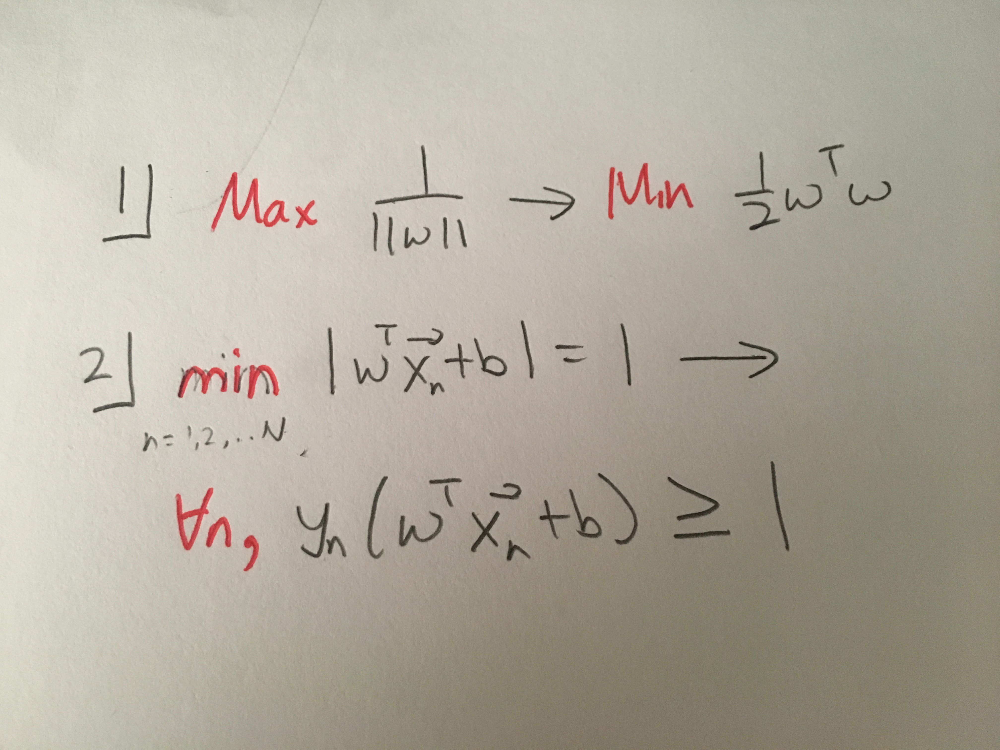
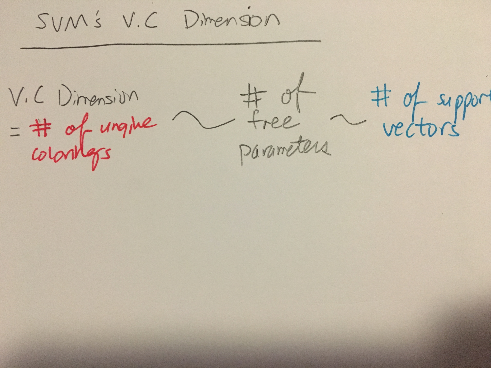

# Support Vector Machine
======================

* **Why it works**: We can afford to shift the line because probability of training point being on boundary is low. 
* Note that the V.C Dimension of the SVM is **dependent** on the dataset, because the constraints are dependent on the dataset.
* Also note that while the SVM is a classifier, to find the final weight vector we will be using calculus. This is because we are doing calculus on a distance cost function, not error cost function.

## Calculating the margin
* This normalization gives a nice formula. Note that it only constrains w to a hypercone. 

## Minimizing the margin
* We got rather far by assuming we know the minimum point. To convert into a usuable form, we need a statement on all the points, since we don't know which one will be the minimum ad priori. 
* Notice that minimizing the margin is "lowering the VC dimension", as was the case in weight decay regularization.

## Nonlinear Transformations with SVM
> Why don't we need to pay the cost of nonlinear transformations for SVM?

* The VC dimension of SVM is more closely related to **the number of support vectors rather than the dimensionality of the space.** 
* This is because **Constraints lower VC dimension**
* So, the cost of nonlinear transformations is not as drastic

