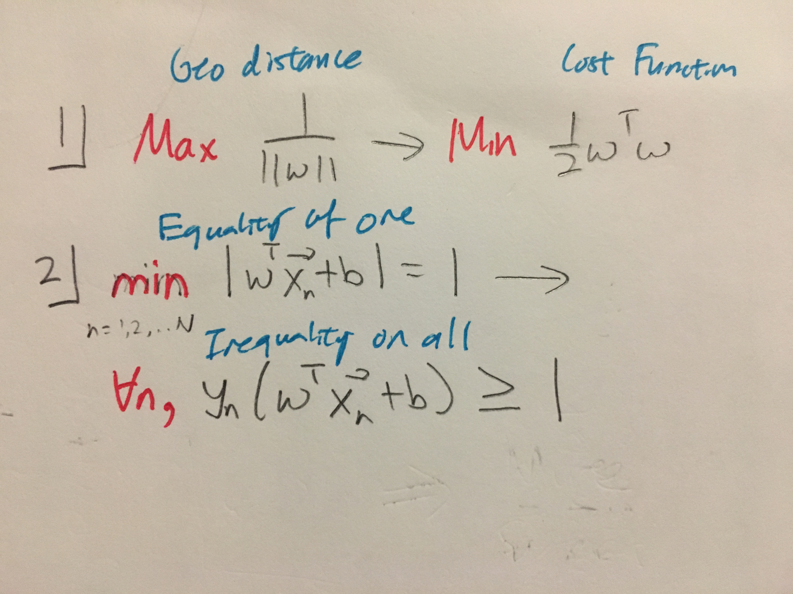

# Support Vector Machine
======================

* **Why it works**: We can afford to shift the line because probability of training point being on boundary is low. 
* Note that the V.C Dimension of the SVM is **dependent** on the dataset, because the constraints are dependent on the dataset.
* Also note that while the SVM is a classifier, to find the final weight vector we will be using calculus. This is because we are doing calculus on a distance cost function, not error cost function.

## Calculating the margin
* This normalization gives a nice formula 

## Minimizing the margin
* Notice that minimizing the margin is "lowering the VC dimension", as was the case in weight decay regularization.
* In general, **Constraints lower VC dimension**

## Nonlinear Transformations with SVM
> Why don't we need to pay the cost of nonlinear transformations for SVM?

* The VC dimension of SVM is more closely related to **the number of support vectors rather than the dimensionality of the space.**
* **So, the cost of nonlinear transformations** is not as drastic

## Kernel Formulation of SVM
In general, we applying a nonlinear transformation, two things change: the final hypothesis and the error function, because these are the objects that depend on the dataset.
* **Hypothesis**

* **Lagrangian(aka Error function)**

