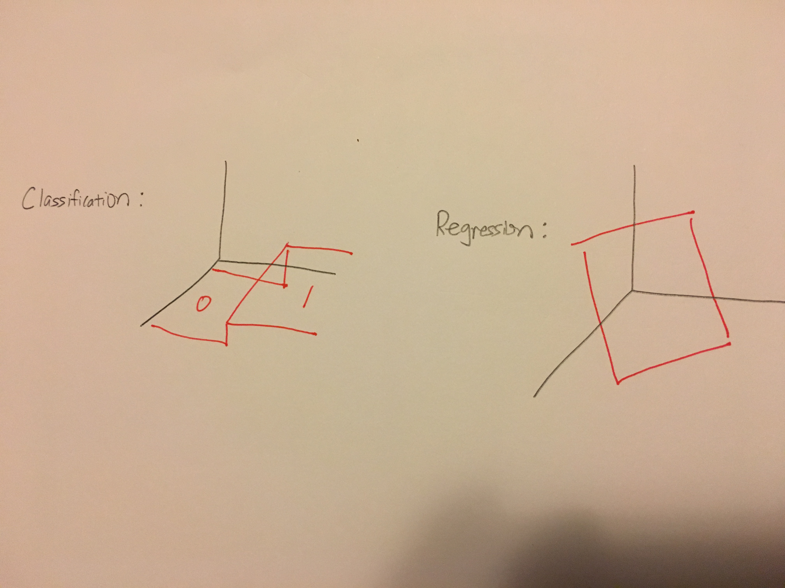
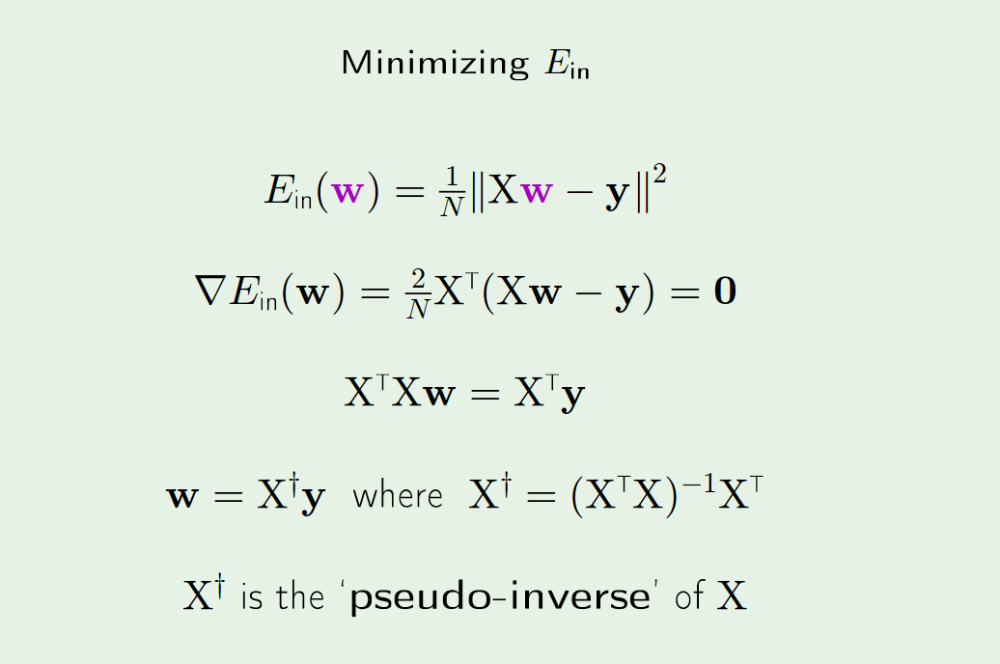

# The Linear Model
================

## Extra Parameter in PLA
* The reason we need the extra parameter is because we don't don't a priori whether the data is good on top or on the bottom

## How Linear Regression differs from Classification
* Although we can think of Classification as drawing a line in between the data set, an alternative visualization would be to view the output as the stitching of two planes. 
* In this way, we can see why classification is not a special case of regression, despite the fact that 1 and 0 are real numbers! 
	* Regression only produces one plane

## Explicit Formula for Regression

* **Why there is no Explicit Formula for Classification**: The range of y values is not a rich enough mathematical object to permit an explicit method(namely differentiation of a manifold)
