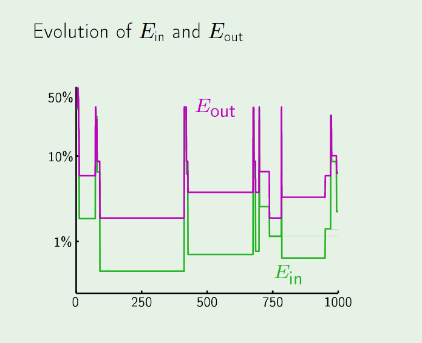

# The Linear Model
================

**Questions go on another branch**

## Why does $E_{out}$ evolve?

* Because $E_{out}(h)$ changes whenever the hypotheses changes. Remember, $E_{out}(h)$ is the percentage of the time the hypothesis agrees with the "true" function on **all** input points. But it is not the true function itself!

## How Linear Regression differs from Classification
* Although we can think of Classification as drawing a line in between the data set, an alternative visualization would be to view the output as the stitching of two planes. 
* In this way, we can see why classification is not a special case of regression, despite the fact that 1 and 0 are real numbers! 
	* Regression only produces one plane

* **Why there is no Explicit Formula for Classification**: The range of y values is not a rich enough mathematical object to permit an explicit method(namely differentiation of a manifold)
