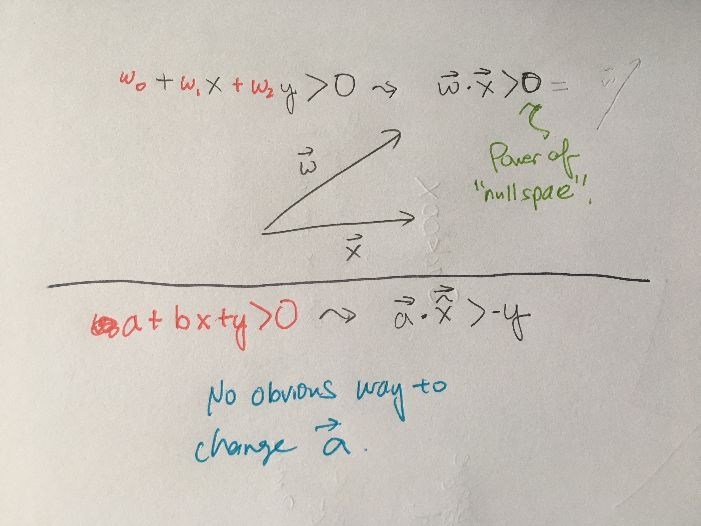

# The Linear Model
================

## How Linear Regression differs from Classification
---
* Although we can think of Classification as drawing a line in between the data set, an alternative visualization would be to view the output as the stitching of two planes. 
* In this way, we can see why classification is not a special case of regression, despite the fact that 1 and 0 are real numbers! 
	* Regression only produces one plane

## Explicit Formula for Regression
---

* **Why there is no Explicit Formula for Classification**: The range of y values is not a rich enough mathematical object to permit an explicit method(namely differentiation of a manifold)

## Linear Model as a Basis
---
* Bunch of Linear Models=Neural Network
* Efficient Nonlinear Transformation= Kernel Methods
* Careful Selection of Boundaru = Support Vector Machine

## Extra
---
### Extra Parameter in PLA
* The reason we need the extra parameter is because we don't don't a priori whether the data is good on top or on the bottom
* The extra parameter is needed so the adjustment makes sense. Without it, we cannot phrase the problem in terms of a inner product, and thus lose the geometric insight.

