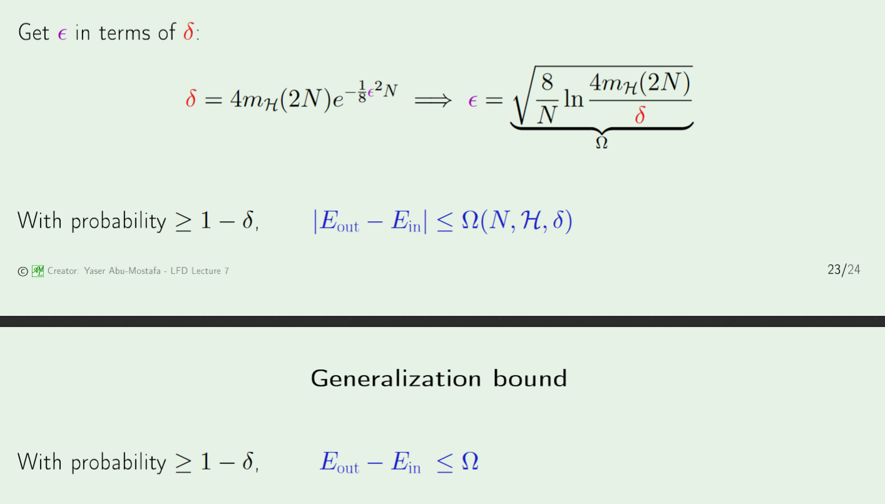

# The VC Dimension
================
> VC Dimension: The most number of point that H can shatter

## Interpretation of the VC Dimension
* It abstracts the expressiveness of a model:
	* higher VC dimension=more parameters(exact for percepton)
	* higher VC dimension=more robust to nonlinear seperable data(b/c it measures max number of "colorings")

## Creating a Generalization Bound
* What the VC inequality tells us is that most of the time, the generalization bound will hold. 
* **Tradeoff**: Better model will give lower $E_{in}$, but bigger growth function, and hence bigger $\Omega$

## Difference between Generalization and Approximation
* Good Generalization means $\delta$ is small.
* Good Approximation means $E_{in}$ is small.
