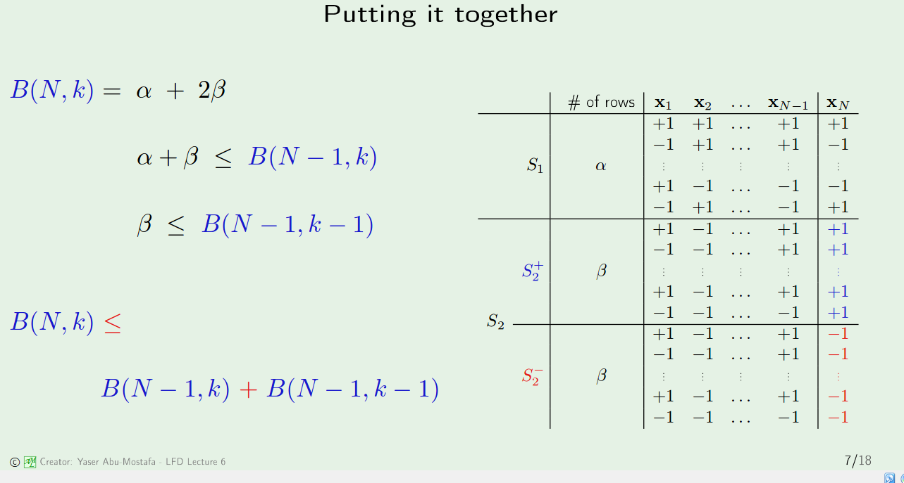
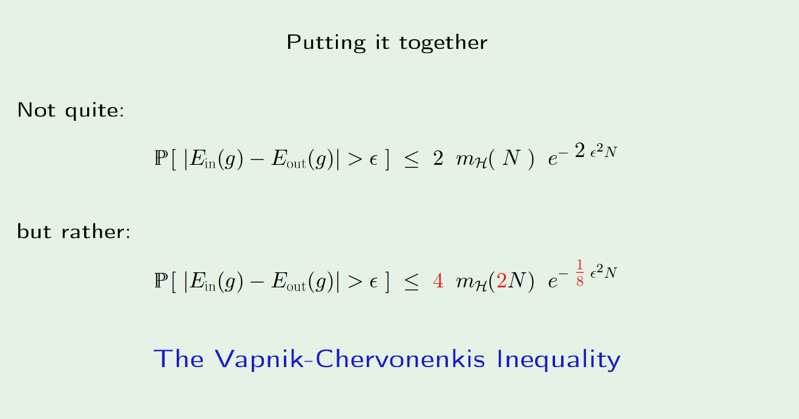

# Theory of Generalization
========================

## How Bounds were achieved
* **Big Idea 1**: Partition B(n,k) by looking at the last column and split into single appearances and double appearances

* **Big Ideas2 **: By assuming worst case scenario, we can easily choose the case that gives rise to a nice analytical expression. This is why there are multiple inequality signs in the picture

> I made this harder on myself by demanding equality between alpha and the constrained growth function

## Justifying the Change to the Growth Function
* Because the professor never explained how to derive the Hoeffding Inequality, there is no way that I can derive the VC-inequality. 
* Just know that we have changed the matching of frequency out of sample to another insample frequency. The advantage of this is that the in sample is **finite**; this somehow will get us to the growth function.

