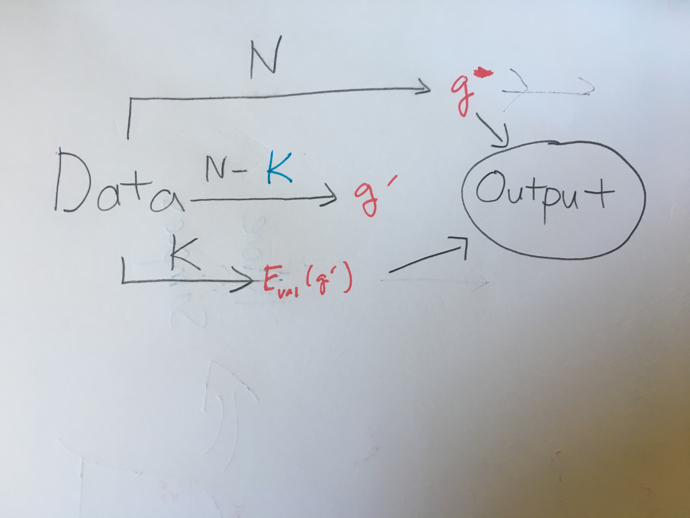
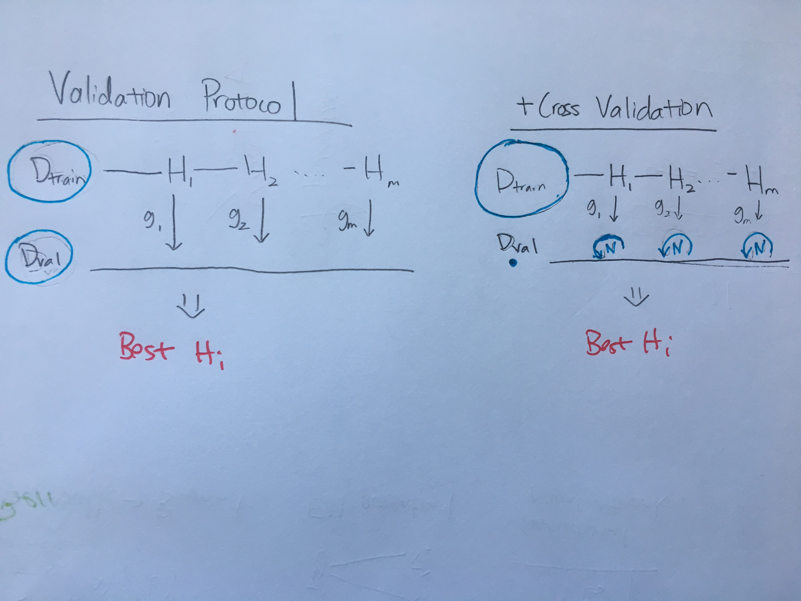

# Validation
==========

## Validation as Error Estimate and its Tradeoff
* $E_{out}(g^-)$ as Good Estimator for $E_{out}(g)$
* $E_{val}(g^-)$ as Good Estimate of Estimator

* We return the "full hypothesis" because we care more about the model than a prediction of the error
* **We do extra training for the purpose of estimating the error of the full hypothesis: because we ran out of datapoints for the final model**

## Cross Validation and Validation for Model Choosing
* Note that this procedure will cause optimistic bias in the error, due to the error being a "weird" function of many random variables.

